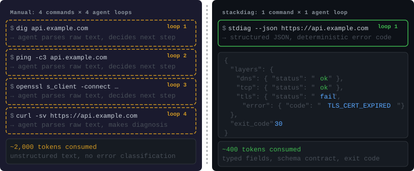

# stackdiag

[](https://github.com/muras3/stackdiag/actions/workflows/ci.yml)
[](LICENSE)
[](https://go.dev)

**One command replaces `dig` + `ping` + `openssl` + `curl`.**
Structured evidence for AI agents. Layer-by-layer network diagnostics for humans.

<picture>
  <source media="(prefers-color-scheme: dark)" srcset="docs/before-after.svg">
  
</picture>

```bash
$ stdiag --json https://api.example.com
# → DNS ✓ → Reachability ✓ → TCP ✓ → TLS ✗ CERT_EXPIRED (exit 30)
# One structured JSON. One tool call. One reasoning loop.
```


## Install

```bash
# macOS / Linux
curl -sL https://github.com/muras3/stackdiag/releases/latest/download/stackdiag_$(uname -s | tr A-Z a-z)_$(uname -m | sed 's/x86_64/amd64/;s/aarch64/arm64/').tar.gz | tar xz
sudo mv stdiag /usr/local/bin/

# Go
go install github.com/muras3/stackdiag/cmd/stackdiag@latest
```

## Quick Start

```bash
stdiag https://example.com                       # full stack check
stdiag --json https://example.com                # JSON for agents
stdiag tcp://db.internal:5432                    # TCP connectivity only
stdiag --tls-scan https://example.com            # TLS version audit
stdiag --count 5 https://example.com             # repeated measurement
stdiag --dns-server 8.8.8.8 https://example.com # custom DNS resolver
```

Exit codes tell you which layer broke — no JSON parsing needed:

| Exit | Layer |
|------|-------|
| 0 | All OK |
| 10 / 15 / 20 / 30 / 40 | DNS / Reachability / TCP / TLS / HTTP |
| 1 | Tool error |

## Why stackdiag

- **Compression, not replacement.** stackdiag compresses the common `dig` → `openssl` → `curl` triage path into one deterministic command. ~80% fewer tokens than running each tool separately. Use raw tools when you need deep manual forensics.

- **Deterministic classification.** Error codes like `TLS_CERT_EXPIRED` and `DNS_NXDOMAIN` are type-based, not regex. Stable across OS, locale, and tool version. Agents can branch on `error.code` without string matching.

- **Schema contract.** `--json` output follows a versioned schema — fields are never removed, types never changed. `stdout` = data, `stderr` = logs. Wrap as an MCP tool or LangChain `tool_call` with zero adaptation.

## Docs

- [JSON Schema & Error Codes](docs/schema.md) — output format, typed fields, exit code contract
- [Design Decisions](docs/design-decisions.md) — architecture rationale
- [Benchmarks](bench/) — reproducible token efficiency measurements

## License

[MIT](LICENSE)
